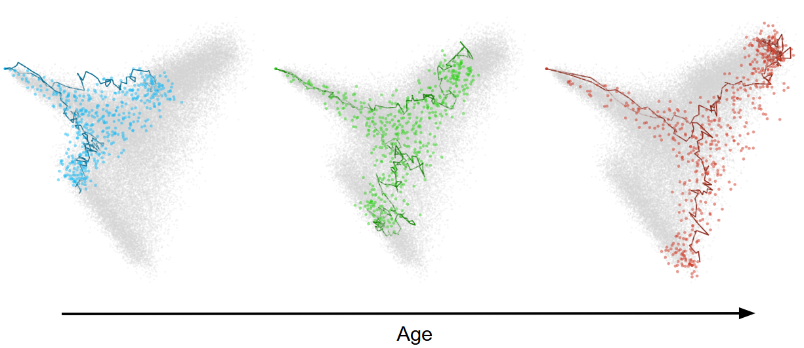
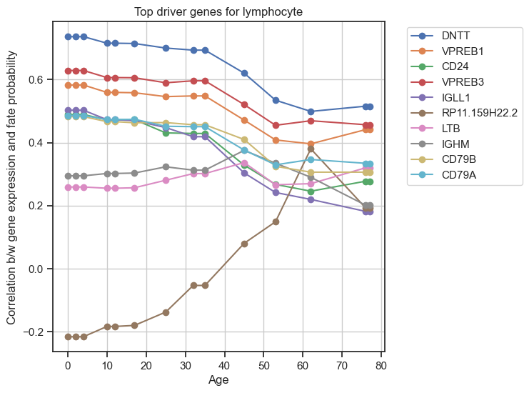

# Global StationaryOT: Trajectory inference for aging time courses of single-cell snapshots





## Installation
Clone the repository and install the package using pip:
```bash
cd global-stationaryOT && pip install -e .
```
We highly recommend installing [JAX](https://github.com/google/jax#installation)'s optional CUDA dependencies if you have a compatible GPU for significantly improved performance. This can be done by running:
```bash
cd global-stationaryOT && pip install -e .[cuda12]
```
## Usage


### Minimal Inputs

1. An [Anndata](https://anndata.readthedocs.io/en/stable/generated/anndata.AnnData.html#anndata.AnnData) object containing:
    <ol type="i">
    <li>An embedding of the expression matrix stored in .obsm (preferably PCA)</li>
    <li> Cell growth rate estimates stored in .obs </li>
    <li> The organism age at which each cell was sampled stored in .obs</li>
    </ol>
2. An estimate of the time, $dt$, it takes for a cell to undergo a single state transition. 
3. An estimate of the entropic regularization parameter, $\varepsilon$.
4. A smoothing parameter, $\lambda$. 


### Quick Start
```python
from gstatot import gStatOT

adata_keys = {
    'embedding_key': 'X_pca',   # embedding in adata.obsm
    'time_key': 'age',          # age in adata.obs
    'growth_key': 'growth_rate' # growth rates in adata.obs
}

dt = 0.25 
model_params = {'lam': 10, 'epsilon2': 0.05} 

gSOT = gStatOT(adata=adata, adata_keys=adata_keys, dt=dt)
gSOT.fit(model_params=model_params)
```
The cell transition matrix at age, ```a```, can then be accessed via:
```python
TM_a = adata.obsp[f'pi_{a}']
```

Cell fate probabilities for a given cell type annotation, ```cell_type```, stored in ```adata.obs``` can be computed via:
```python
gSOT.get_lin_fate_probs(label_key='cell_type')
```
The fate probabilities will be stored in ```adata.obsm[f'{label_key}_fate_probs']```.

Similar to Weiler et al.'s [CellRank](https://cellrank.readthedocs.io/en/stable/), we use the correlation between computed fate probabilities and gene expression to identify driver genes for each fate, except we provide an implementation that uses a weighted correlation to take advantage of gStatOT's globally support transition matrices. This can be done on an ```adata``` fit with a gStatOT model via: 
```python
from gstatot import driver_genes

dg_id = driver_genes.gene_selection(adata, adata_keys=adata_keys)
dg_id.get_fp_expression_corr(label_key='cell_type')
```


Gene correlations will be stored in an [xarray.DataArray](https://xarray.pydata.org/en/stable/generated/xarray.DataArray.html) accessible via ```dg_id.gene_corrs_xr``` using the fate names and age e.g.:
```python
top_5_lymphocyte_genes_day_10 = dg_id.gene_corrs_xr.sel(fate='lymphocyte', age=10).sort_values(ascending=False).head(5).index.tolist()
```
To plot the top correlated genes for specific fates over age we have the following
```python
dg_id.plot_top_corr_over_age(fate_names=['lymphocyte'], n_top_genes=5)
```


This function forms a set of the top correlated genes at each age for the specified fates, and plots their correlation trends. Hence, the plot may contain more than ```n_top_genes``` genes if the top genes vary over age.


## Example Notebooks
Example notebooks demonstrating the use of Global StationaryOT on simulated and real data can be found in the [examples](examples/) directory.

