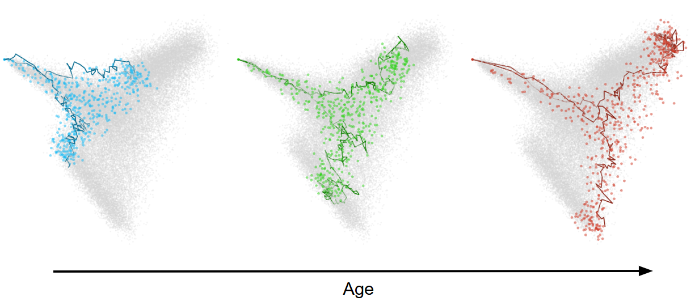
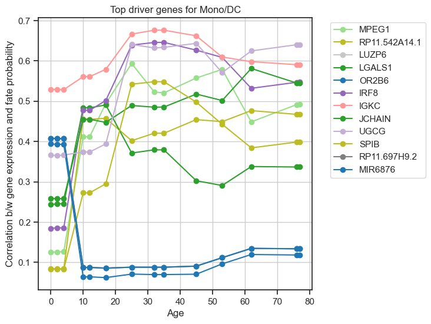

# Global StationaryOT: Trajectory inference for aging time courses of single-cell snapshots





## Installation
Clone the repository and install the package using pip:
```bash
cd global-stationaryOT && pip install -e .
```
We highly recommend installing [JAX](https://github.com/google/jax#installation)'s optional CUDA dependencies if you have a compatible GPU for significantly improved performance. This can be done by running:
```bash
cd global-stationaryOT && pip install -e .[cuda12]
```
## Example Notebooks
Example notebooks demonstrating the use of Global StationaryOT on simulated and real data can be found in the [examples](examples/) directory. Simulated data and preprocessed hematopoiesis data can be downloaded [here](https://doi.org/10.5281/zenodo.20723235) or generated using the scripts and notebooks in the [extra/data](extra/data_preprocessing) directory.

## Usage


### Minimal Inputs

1. An [Anndata](https://anndata.readthedocs.io/en/stable/generated/anndata.AnnData.html#anndata.AnnData) object containing:
    <ol type="i">
    <li>An embedding of the expression matrix stored in .obsm (preferably PCA)</li>
    <li> Cell growth rate estimates stored in .obs </li>
    <li> The organism age at which each cell was sampled stored in .obs</li>
    </ol>
2. An estimate of the time, $dt$, it takes for a cell to undergo a single state transition. 
3. An estimate of the entropic regularization parameter, $\varepsilon$.
4. A smoothing parameter, $\lambda$. 


### Quick Start
```python
from gstatot import gStatOT

adata_keys = {
    'embed_key': 'X_pca',   # embedding in adata.obsm to run gStatOT on
    'time_key': 'age',          # the key in adata.obs that contains the age at which each cell was sampled 
    'growth_key': 'growth_rate' # the key in adata.obs that contains the growth rates
}

dt = 0.25 
model_params = {'lam': 10, 'epsilon2': 0.05} 

gSOT = gStatOT(adata=adata, adata_keys=adata_keys, dt=dt)
gSOT.fit(model_params=model_params)
```
The cell coupling matrix at age, ```a```, can then be accessed via:
```python
TM_a = adata.obsp[f'pi_{a}']
```
This can then be row-normalized to get the transition matrix at age ```a```:
```python
from gstatot.utils import row_normalize
TM_a_normalized = row_normalize(TM_a)
```

Cell fate probabilities for a given cell type annotation, ```cell_type```, stored in ```adata.obs``` can be computed via:
```python
import numpy as np
gSOT.get_lin_fate_probs(label_key='cell_type', all_labels=np.unique(adata.obs['cell_type']))
```
The fate probabilities will be stored in ```adata.obsm[f'{label_key}_fp_t={a}']```, for each age ```a``` in the time course.

Similar to Weiler et al.'s [CellRank](https://cellrank.readthedocs.io/en/stable/), we use the correlation between computed fate probabilities and gene expression to identify driver genes for each fate, except we provide an implementation that uses a weighted correlation to take advantage of gStatOT's globally support transition matrices. This can be done on an ```adata``` fit with a gStatOT model via: 
```python
from gstatot import gene_selection 

dg_id = gene_selection.gene_selection(adata, adata_keys=adata_keys)
dg_id.get_fp_expression_corr(label_key='cell_type', fate_names=['Mono/DC'])
```

To plot the top correlated genes for specific fates over age we have the following
```python
dg_id.plot_top_corr_over_age(fate_names=['Mono/DC'], n_top_genes=5)
```


This function forms a set of the top correlated genes at each age for the specified fates, and plots their correlation trends. Hence, the plot may contain more than ```n_top_genes``` genes if the top genes vary over age.


## Paper & Citation
Please see our [paper](https://www.biorxiv.org/content/10.64898/2025.12.18.694987v1) for a detailed description of the method.

Citation:

Cole Boyle, Elias Ventre, Geoffrey Schiebinger. Global StationaryOT: Trajectory inference for aging time courses of single-cell snapshots. bioRxiv. 2025. https://doi.org/10.64898/2025.12.18.694987

#### Results & Figure Reproduction
Scripts and notebooks to reproduce the figures from the main text can be found in the [extra/figures](extra/figures/) directory. The figures were generated using Python 3.13.7; the specific package versions for the required libraries can found in [extra/figures/requirements.txt](extra/figures/figure_requirements.txt). The simulated data and preprocessed hematopoiesis data can be downloaded at https://doi.org/10.5281/zenodo.20723235 or generated using the scripts and notebooks in the [extra/data](extra/data_preprocessing) directory.

